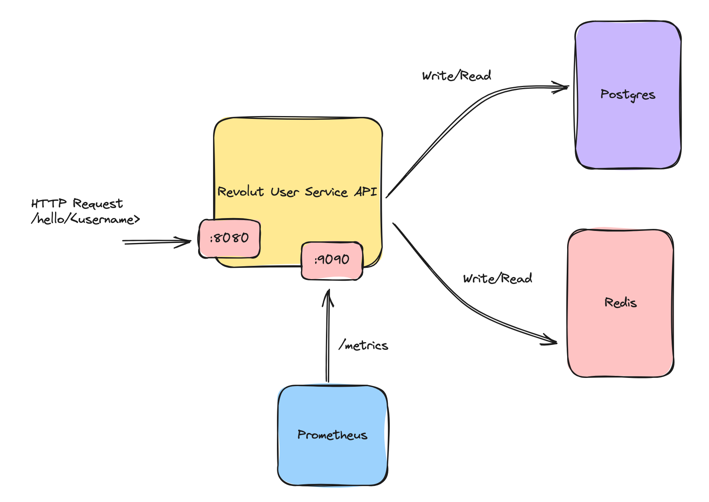

# Architecture

The code is organised using the [Clean Architecture](https://blog.cleancoder.com/uncle-bob/2012/08/13/the-clean-architecture.html) approach.

* Uses dependency injection heavily for inject dependencies needed by different components rather than having the components create those dependencies within their constructor functions. This make it easier to test the code.
* Uses structured logging to `STDOUT` through Uber's `zap` library. See `pkg/common/log.go`
* Exposes Prometheus metrics on `/metrics` that collects latencies of each HTTP path using histogram. See `pkg/api/metrics.go`.
